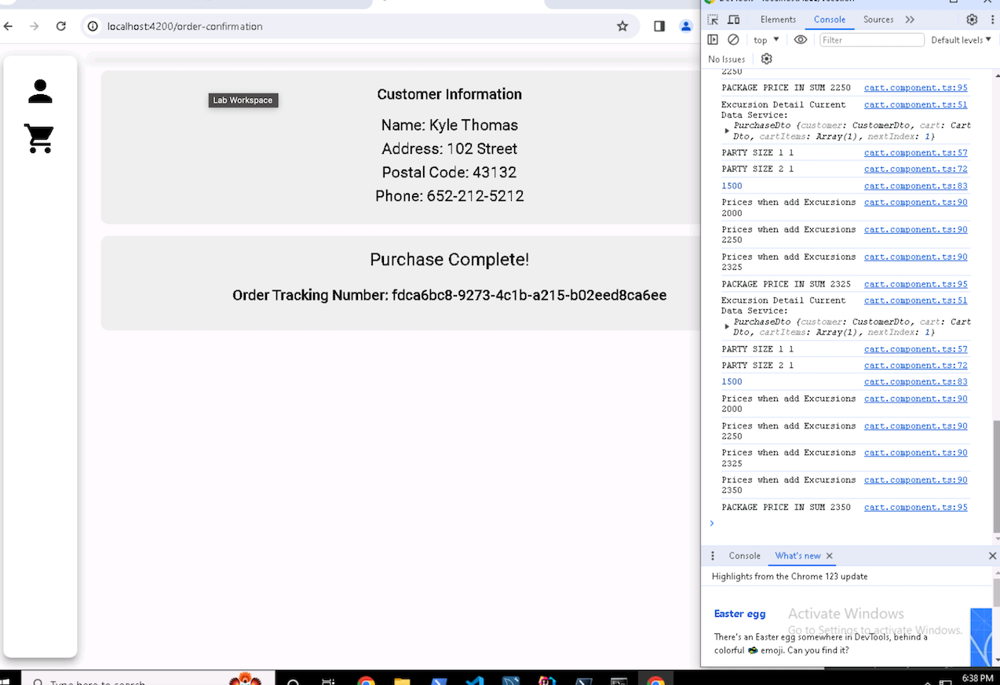
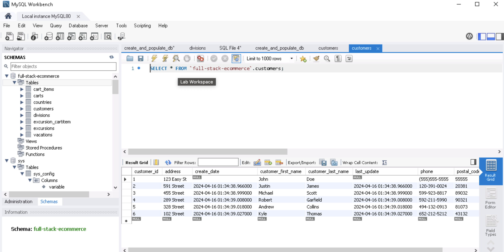
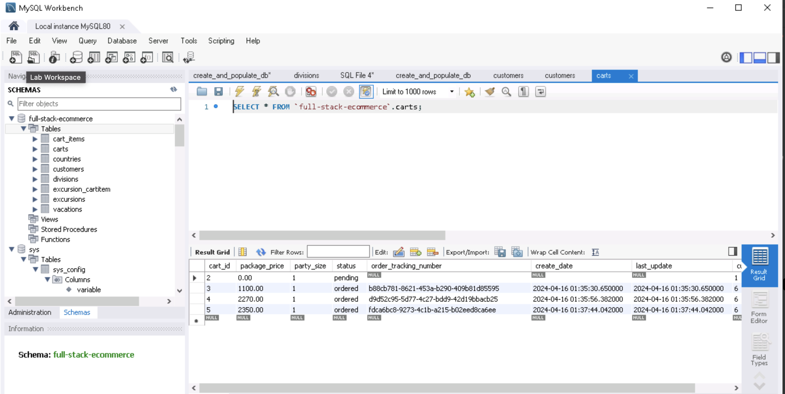
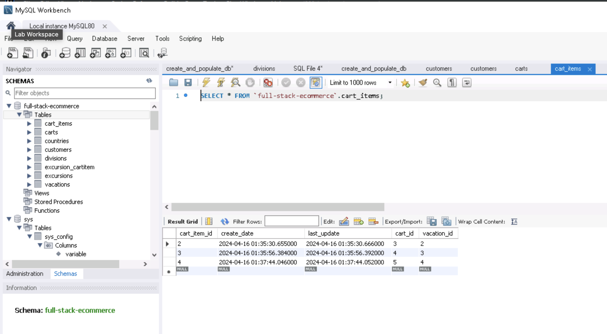
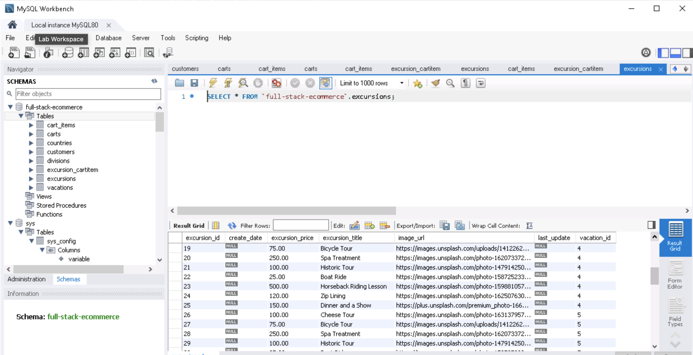
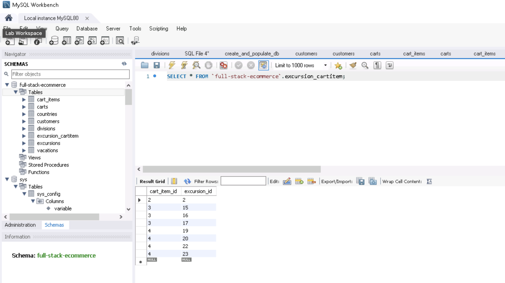

# Travel Booking Backend API

A production-style Spring Boot backend for a travel booking platform. The system manages destinations, customers, carts, vacation packages, and excursions, and supports a full checkout flow that generates an order tracking number.

This backend is designed to demonstrate practical engineering skills: REST API design, relational data modeling, transactional business logic, and clean domain-layer organization.

## Background

The travel agency's booking frontend was rebuilt in Angular, but it depended on a legacy backend that had become difficult to maintain and troubleshoot. As API bugs increased and domain behavior remained undocumented, the business needed a modern backend foundation that could be supported long term.

This implementation delivers an MVP migration of mission-critical booking flows to Spring Boot, with a focus on reliable data persistence, clear API contracts, and maintainable architecture.

## Architecture

This backend follows a layered architecture:

- Controller layer for API endpoints and HTTP request/response handling.
- Service layer for transactional business logic.
- Repository layer for persistence through Spring Data JPA.
- JPA entity layer for relational domain modeling.

## What I Built

- Designed a normalized travel commerce domain model with JPA/Hibernate.
- Implemented repository-driven REST resources for core entities.
- Built a transactional checkout service to convert a cart into an ordered purchase.
- Added bootstrap logic to seed realistic customer data during startup.
- Configured CORS and REST behavior for frontend integration.

## Tech Stack

- Java 17
- Spring Boot 3.2
- Spring Data JPA
- Spring Data REST
- Hibernate
- MySQL 8
- Maven
- Lombok

## Core Domain Model

- `Country` -> `Division` -> `Customer`
- `Customer` -> `Cart`
- `Cart` -> `CartItem`
- `CartItem` -> `Vacation`
- `CartItem` <-> `Excursion` (many-to-many)

Checkout updates cart state to `ordered`, assigns a UUID tracking number, and persists the cart/item graph in a single transaction.
The checkout flow is wrapped in one transactional boundary so carts, cart items, and excursion relationships are committed atomically or rolled back together on failure.

## Screenshots (Quick Proof)

Screenshots help reviewers validate outcomes quickly without cloning and running the codebase.

Place these files in `screenshots/`:

- `screenshots/01-order-confirmation.png` - successful checkout with generated tracking number
- `screenshots/02-customers-table.png` - seeded customers in MySQL
- `screenshots/03-carts-table.png` - cart status and tracking number persistence
- `screenshots/04-cart-items-table.png` - cart item records after checkout
- `screenshots/05-excursions-table.png` - excursion catalog data
- `screenshots/06-excursion-cartitem-table.png` - many-to-many join table proof









## Why This Matters

This backend demonstrates real-world patterns: legacy modernization, aggregate persistence, transactional workflows, relational modeling, and API-driven commerce flows.

## API Overview

Base path:

- `/api`

Spring Data REST resources:

- `/api/countries`
- `/api/divisions`
- `/api/customers`
- `/api/vacations`
- `/api/excursions`
- `/api/carts`
- `/api/cartItems`

Custom checkout endpoint:

- `POST /api/checkout/purchase`

### Example Checkout Request

```json
{
  "customer": {
    "id": 1
  },
  "cart": {
    "package_price": 1999.99,
    "party_size": 2
  },
  "cartItems": [
    {
      "vacation": { "id": 2 },
      "excursions": [
        { "id": 5 },
        { "id": 7 }
      ]
    }
  ]
}
```

### Example Checkout Response

```json
{
  "orderTrackingNumber": "f4dc7830-2e13-4a98-9d95-5f0f2f4f22da"
}
```

## Running Locally

### Prerequisites

- JDK 17+
- MySQL 8+
- Maven (or use `./mvnw`)

### Database Configuration

Update credentials in:

- `src/main/resources/application.properties`

Default connection target:

- Database: `full-stack-ecommerce`
- User: `ecommerceapp`

### Start the Application

```bash
./mvnw spring-boot:run
```

The API will be available at:

- `http://localhost:8080/api`

## Code Structure

- `src/main/java/.../entities` - JPA entities and relationships
- `src/main/java/.../dao` - repository layer and REST exposure
- `src/main/java/.../services` - checkout service + DTO contracts
- `src/main/java/.../controllers` - checkout controller
- `src/main/java/.../bootstrapdata` - startup seed data
- `src/main/java/.../config` - REST configuration

## Engineering Highlights

- Transaction-safe checkout (`@Transactional`) to keep order writes consistent.
- Atomic write behavior across cart, cart items, and excursions to protect data integrity.
- UUID tracking number generation for externally shareable order IDs.
- Validation annotations on customer fields for stronger data quality.
- Explicit CORS setup for local frontend integration.

## Next Improvements

- Add integration tests for checkout and repository endpoints.
- Introduce DTO validation on purchase payloads.
- Add global exception handling with consistent API error responses.
- Implement auth and role-based access control.
